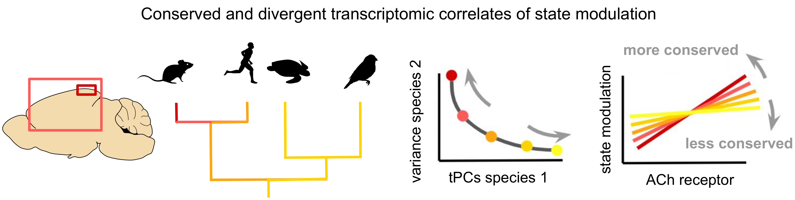
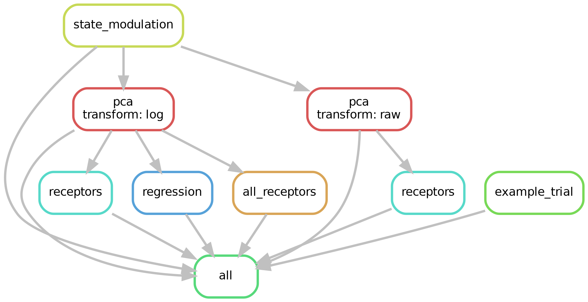

# Transcriptomic axes of GABAergic interneuron diversity
Analysis of how the inhibitory neural activity from different species might vary with an animal's internal state (arousal, locomotion),
based on single-cell transcriptomics and circuit modelling. This repository contains the code used to produce the paper's figures, starting
from downloading the raw data. See the [preprint](https://doi.org/10.1101/2023.12.04.569849) for more information.

>Keijser, J., Hertäg, L., & Sprekeler, H. (2023). Transcriptomic correlates of state modulation in GABAergic interneurons:
>A cross-species analysis. bioRxiv, 2023-12.

<p align="center">
  
</p>

The analysis code (see `workflow/scripts`) is combined into a pipeline using [Snakemake](https://snakemake.readthedocs.io/en/stable/). This is done through input/output rules (see `workflow/rules`), which form a directed acyclic graph (DAG) through which the data flows. The figure shows the DAG of the first supplementary figures.

<p align="center">
  
</p>

After installation, this figure can be recreated by running
```
snakemake -s workflow/rules/fig1.smk -f --dag | dot -Tpng -Gdpi=300 > figures/dags/fig1.png
```

## Installation

Clone the repository:
```
git clone github.com/JoramKeijser/transcriptomic_axes/
```
Recreate the [conda/mambda](https://github.com/mamba-org/mamba) environment with the required Python packages:
```
cd transcriptomic_axes/
mamba env create --name tpc --file environment.yml
mamba activate tpc
```
Also recreate the R environment using [renv](https://rstudio.github.io/renv/index.html):
```
R -e 'renv::init()'
```
Finally, install the project package:
```
pip install -e .
```

## Running the code
The pipeline is distributed across multiple rules (`workflow/rules`), one for each figure. There are also two
preliminary rules for downloading the data and preprocessing the datasets. Individual rules/workflows are not connected; the `download` and `preprocess` workflows therefore have to be executed before any of the others.

To generate all results (figures and data output) corresponding to, say, figure 1, run:

```
snakemake -s workflow/rules/fig1.smk --cores
```

These commands will run on your local machine, but to maximally benefit from Snakemake's power for parallelisation,
(and to have sufficient RAM for handling the larger datasets), it's advisable to use a computing cluster.

As an example, the `run.sh` script submits jobs to a [SLURM](https://slurm.schedmd.com/overview.html) cluster:
```
sbatch run.sh -s workflow/rules/fig1.smk
```
In this case, the output from rule `all` will not be printed to the command line but to a file in the `log/` directory; the output of individual jobs will be printed to files in `log/jobs/`.

## Acknowledgements

We are grateful to everyone who previously collected & published the data analysed here:
* Bakken, Trygve E., et al. "Comparative cellular analysis of motor cortex in human, marmoset and mouse." Nature 598.7879 (2021): 111-119.
* Bugeon, Stephane, et al. "A transcriptomic axis predicts state modulation of cortical interneurons." Nature 607.7918 (2022): 330-338.
* Colquitt, Bradley M., et al. "Cellular transcriptomics reveals evolutionary identities of songbird vocal circuits." Science 371.6530 (2021): eabd9704.
* Hodge, Rebecca D., et al. "Conserved cell types with divergent features in human versus mouse cortex." Nature 573.7772 (2019): 61-68.
* Tasic, Bosiljka, et al. "Shared and distinct transcriptomic cell types across neocortical areas." Nature 563.7729 (2018): 72-78.
* Tosches, Maria Antonietta, et al. "Evolution of pallium, hippocampus, and cortical cell types revealed by single-cell transcriptomics in reptiles." Science 360.6391 (2018): 881-888.
* Yao, Zizhen, et al. "A taxonomy of transcriptomic cell types across the isocortex and hippocampal formation." Cell 184.12 (2021): 3222-3241.
